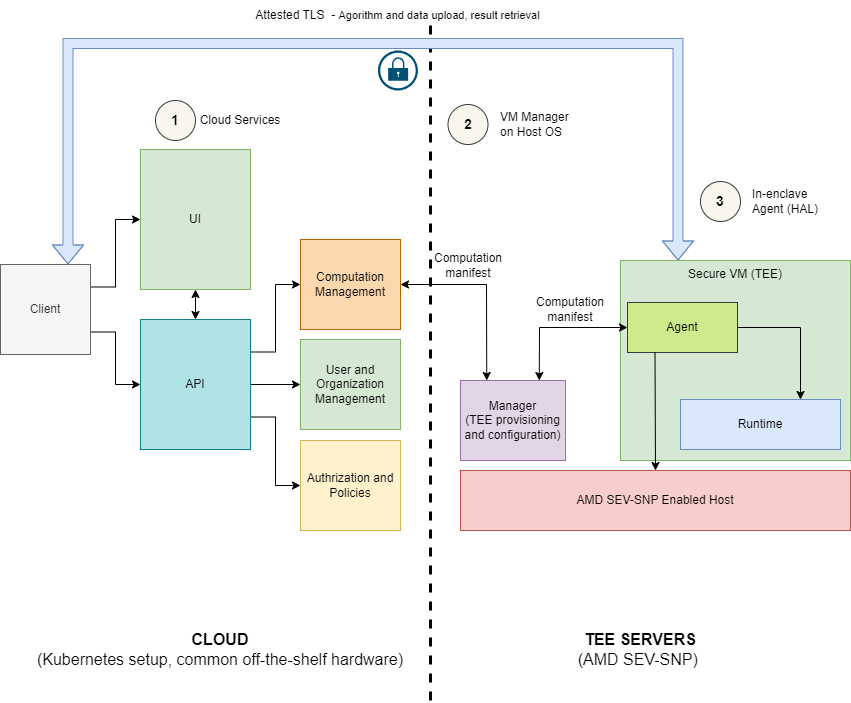

# Architecture

Cocos AI system is a distributed platform for running secure multi-party computations.

It has 2 parts:

- Manager, that acts as a bridge between the web and the TEE and controls the creation and management of computations in the TEE.
- In-TEE (Trusted Execution Environment) fimrware, otherwise called Agent

The system architecture is illustrated in the image below.

{ align=center }

## Agent

Agent defines firmware which goes into the TEE and is used to control and monitor computation within TEE and enable secure and encrypted communication with outside world (in order to fetch the data and provide the result of the computation). The Agent contains a gRPC server that listens for requests from gRPC clients. Communication between the Manager and Agent is done via vsock. The Agent sends events to the Manager via vsock, which then forwards these via gRPC. Agent contains a gRPC server that exposes useful functions that can be accessed by other gRPC clients such as the CLI.

## Manager

Manager is a gRPC client that listens to requests sent through gRPC and sends them to Agent via vsock. Manager creates a secure enclave and loads the computation where the agent resides. The connection between Manager and Agent is through vsock, through which channel agent sends events periodically to manager, who forwards these via gRPC.

## CLI

CoCoS CLI is used to access the agent within the secure enclave. CLI communicates to agent using gRPC, with funcitons such as algo to provide the algorithm to be run, data to provide the data to be used in the computation, and run to start the computation. It also has functions to fetch and validate the attestation report of the enclave.

For more information on CLI, please refer to [CLI docs](./cli.md).
